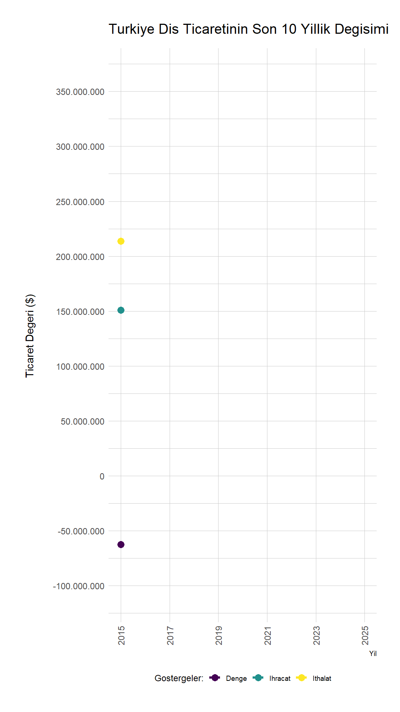
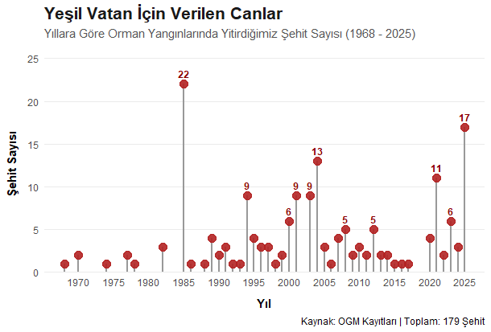

# 📊 Visual Data Lab

Instagram hesabımda paylaştığım veri görselleştirme çalışmalarının kaynak kodları ve grafikleri. Bir istatistik öğrencisi gözünden hazırladığım bu analizleri ve grafikleri burada derliyorum.

## 📂 Projeler

Grafiklerin önizlemelerini ve kaynak kodlarını aşağıda bulabilirsiniz. Liste uzadıkça okumayı kolaylaştırmak için tablo yapısı kullanılmıştır. *(Yeni eklenenler en üste gelecek şekilde sıralayabilirsiniz.)*

| Önizleme | Açıklama & Kaynak Kod |
| :---: | :--- |
|  | **Son 10 Yıllık Dış Ticaret** Türkiye'nin son 10 yıllık dış ticaret verilerinin zaman içindeki değişimini gösteren animasyonlu grafik. 👉 [Kodları İncele (tr_dis_ticaret.md)](tr_dis_ticaret.md) |
|  | **Şehitlerimiz** Şehitlerimiz anısına hazırlanan veri görselleştirme çalışması. 👉 [Kodları İncele (sehit.md)](sehit.md) |

---

## 🛠️ Nasıl Kullanılır?
Bu repodaki `*.md` dosyaları, ilgili grafiklerin nasıl oluşturulduğuna dair kodları ve adımları içerir. Kodları kendi veri setlerinize uyarlayarak benzer görselleştirmeler üretebilirsiniz.

## 📌 İletişim & Sosyal Medya
Çalışmaların son hallerini görmek için beni takip edebilirsiniz:
* **Geliştirici:** Arif Furkan Aytekin
* **Instagram:** [@grafik.izi](https://instagram.com/grafik.izi)
